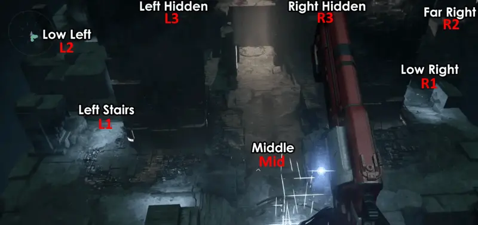
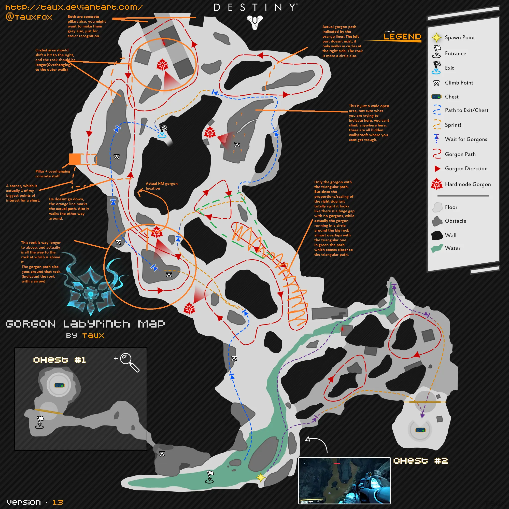
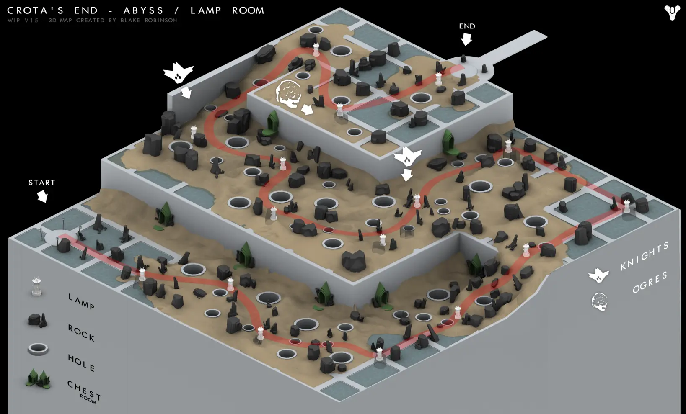

# Raids

> Luke Smith described every raid as having a unique "heartbeat" that distinguishes it from other raids. Vault of Glass is about spreading players out and then bringing them back together. Crota's End is about creating "hero moments," where a single player is relied upon to carry out an important task. King's Fall is about movement and positioning. Wrath of the Machine is about action and "glorious combat."

## Checkpoint

Tout le monde conserve un checkpoint et peut reprendre la partie au même endroit en étant chef d'équipe.

Le checkpoint est effacé lors du reset, tous les mardis à 19h. Pour conserver le checkpoint, il faut être dans le raid à ce moment-là. Seule exception : cela ne fonctionnera pas si la difficulté du raid ne peut plus être sélectionnée lors de la nouvelle semaine.

## Difficulté

Le mode difficile d'un raid augmente le niveau de lumière requis, désactive la réanimation (sauf la Radiance), ajoute le modificateur Héroïque (*vos ennemis apparaissent en plus grand nombre et sont plus agressifs*) ainsi que des mécaniques au raid. Le mode à 390 de Lumière reprend les changements du mode difficile et ajoute des défis à certaines phases. Le raid de la semaine est joué en mode 390 avec tous les défis activés.

### Nombre de joueurs

Minimum recommandé par la communauté :

- Le Caveau de verre (Vault of Glass) : 4-5
- La Chute de Cropta (Crota's End) : 4 (c'est le minimum pour ne pas cheese le pont)
- La Chute du roi (King's Fall) : 5-6
    - Pour les mécaniques : Rupture: 3, Totems: 4, Warpriest: 3, Golgo: 2, Daughters: 4, Oryx: 1 Sunsinger or 4 non-Sunsingers
- Fureur mécanique (Wrath of the Machine) : 4-5

## Le Caveau de verre (Vault of Glass)

- [ ] Normal (Niveau 26)
- [ ] Difficile (Niveau 30)
    - Deux oracles apparaissent à la fois (on peut être marqué pour la négation deux fois)
    - Gorgones supplémentaires fixes, limitant les passages empruntables
    - Atheon : lors de la TP, les joueurs toujours dans l'arène sont emprisonnées dans des bulles rouges qu'ils doivent détruire
- [ ] Lumière 390

### Quêtes liées

- Forgé sans Lumière -- Etape 5 : vaincre Atheon

### Stratégies pour solo/cheese

**[Full Run](https://www.youtube.com/watch?v=ir-j1RfOwEs): 2 joueurs**

- Entrée: [1](https://www.youtube.com/watch?v=BYZ1vTA539I)
- Confluxes: [1](https://www.youtube.com/watch?v=-h8iEWGsixI)
- Templar: [1](https://www.youtube.com/watch?v=wTe7LOx9X3Y)
- Gorgons: 1
- Gatekeeper: [2](https://www.youtube.com/watch?v=K60OdsQqqiw)
- Atheon: [1](https://www.youtube.com/watch?v=TJwwrZuiTJU)

### Entrée

Il faut activer et protéger trois plaques simultanément. Pour activer une plaque, il faut rester dessus quelques secondes. On peut ensuite la quitter, et seuls les Praetoriens peuvent en reprendre le contrôle. Les Praetoriens ont un bouclier abyssal.

### Oracles

Position des oracles :

### Le Labyrinthe aux Gorgones


L'invisibilité du Chasseur fonctionne.


### Atheon

Atheon téléporte 3 joueurs ; il doit y avoir au moins un joueur supplémentaire pour ouvrir les portails. Pour faire le boss à 3 ou moins, il faut un Arcaniste qui tombe dans le vide avant qu'Athéon téléporte puis se self-res.

## La Chute de Cropta (Crota's End)

- [x] Normal (Niveau 30)
- [ ] Difficile (Niveau 33)
    - The Shriekers in the long hallway after the Bridge respawn quickly.
    - During the Deathsinger encounter, the Liturgy of Ruin comes 1 minute quicker.
    - A Gatekeeper spawns with the Swordbearer during the Crota encounter.
    - During the Crota encounter, when a pair of Boomers are killed, a Wizard spawns instead of a Cleaver Knight.
    - Crota enrages when he reaches low health.
- [ ] Lumière 390

### Stratégies pour solo/cheese

**[Full Run](https://www.youtube.com/watch?v=OXDEx2p6BiE): 1 joueur**

- Abyss: [1](https://www.youtube.com/watch?v=pq3gUeE1DDg)
- Bridge: [1](https://www.youtube.com/watch?v=Q2EFerlsgq4)
- Deathsinger: [1](https://youtu.be/OXDEx2p6BiE?t=26m4s)
- Crota: [1](https://www.youtube.com/watch?v=wmPj5eUQzvg)

### Abysse

## La Chute du roi (King's Fall)

- [ ] Normal (290)
- [ ] Difficile (310)
- [ ] 390

### Quêtes liées

- La Chute du roi approche -- Etape 2 : vaincre le Prêtre de guerre, Golgoroth, et Oryx
- L'appétit ancestral -- Etape 1 : obtenir la Lame de la famine, le Voile d'Ir Anûk, et le Cœur affamé

### Stratégies pour solo/cheese

**[Full Run](https://www.youtube.com/watch?v=wMOLonTUNB4): 4 joueurs**

- Opening: [1](https://www.youtube.com/watch?v=xN34G8JauMo)
- Totems: [2](https://www.youtube.com/watch?v=huO0KnE2A6M)
- Warpriest: [3](https://www.youtube.com/watch?v=dTL8DvN0aTU)
- Golgoroth: [2](https://www.youtube.com/watch?v=w0nLKQJbK8o)
- Daughters: [4](https://youtu.be/wMOLonTUNB4?t=52m24s)
- Oryx: [1](https://www.youtube.com/watch?v=nVXRsp22xlc)

## Fureur mécanique (Wrath of the Machine)

- [ ] Normal (370)
- [ ] Difficile (380)
- [ ] Mode 390 : remplace le 380 ; uniquement accessible lorsque c'est le raid de la semaine.

### Quêtes liées

- Fureur mécanique -- Etape 1 : vaincre l'Archiprêtre, l'Engin de siège, et Aksis

### Stratégies pour solo/cheese

**[Full Run](https://youtu.be/OHH-TmWdEgI?t=59s): 2 joueurs**

- Opening: [1](https://www.youtube.com/watch?v=VRbp0-BKw-8)
- Vosik: [2](https://www.youtube.com/watch?v=-nLzv49r7WM)
- Siege Engine: [2](https://www.youtube.com/watch?v=EZZafkmS_j8) / [1](https://www.youtube.com/watch?v=jh3UoSrC4tE) (*It is impossible to solo Siege Engine on Normal mode according to all currently know strategies. However, it is possible on Hard due to the extended timer. As of now this has only been done with a macro, however.*)
- Aksis1: [1](https://www.youtube.com/watch?v=7dgCcIiRGoI)
- Aksis2: [1](https://www.youtube.com/watch?v=QcEocDfkDOQ) / [2](https://www.youtube.com/watch?v=Orhs8X2v-RY)
