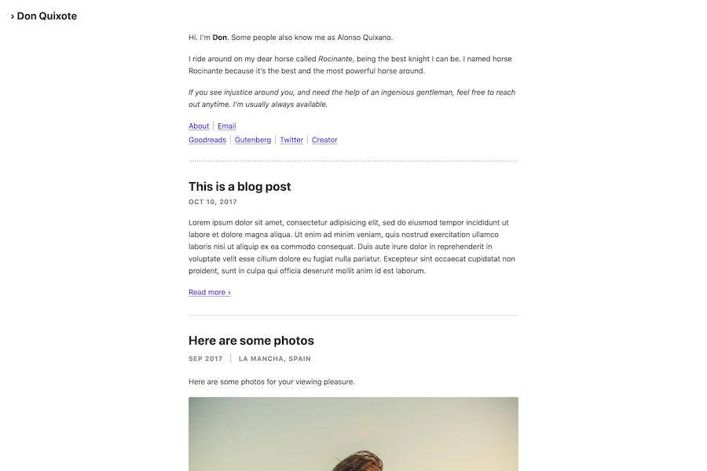
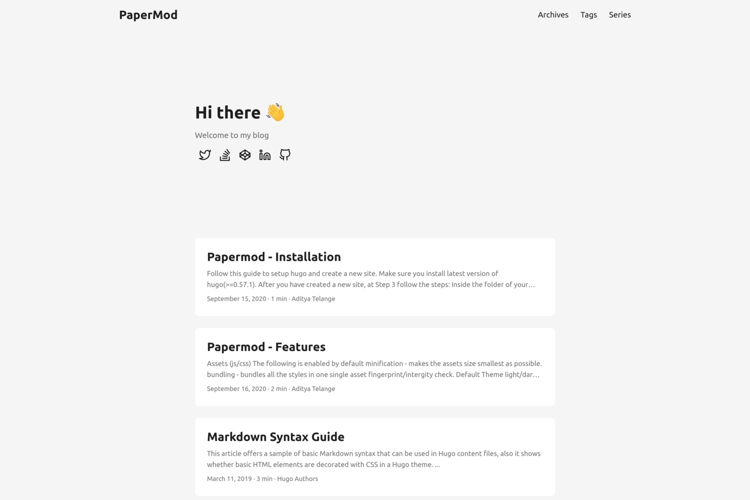
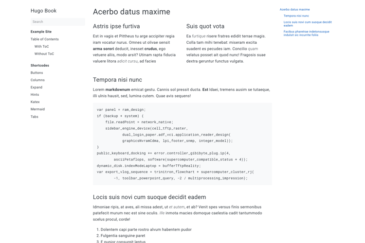
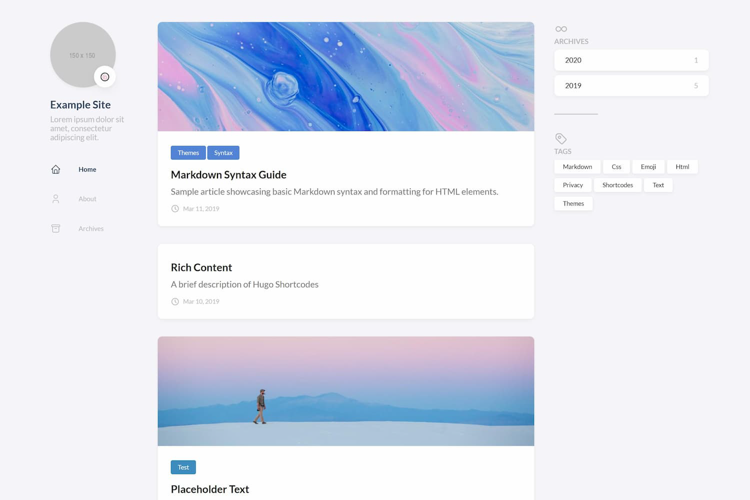
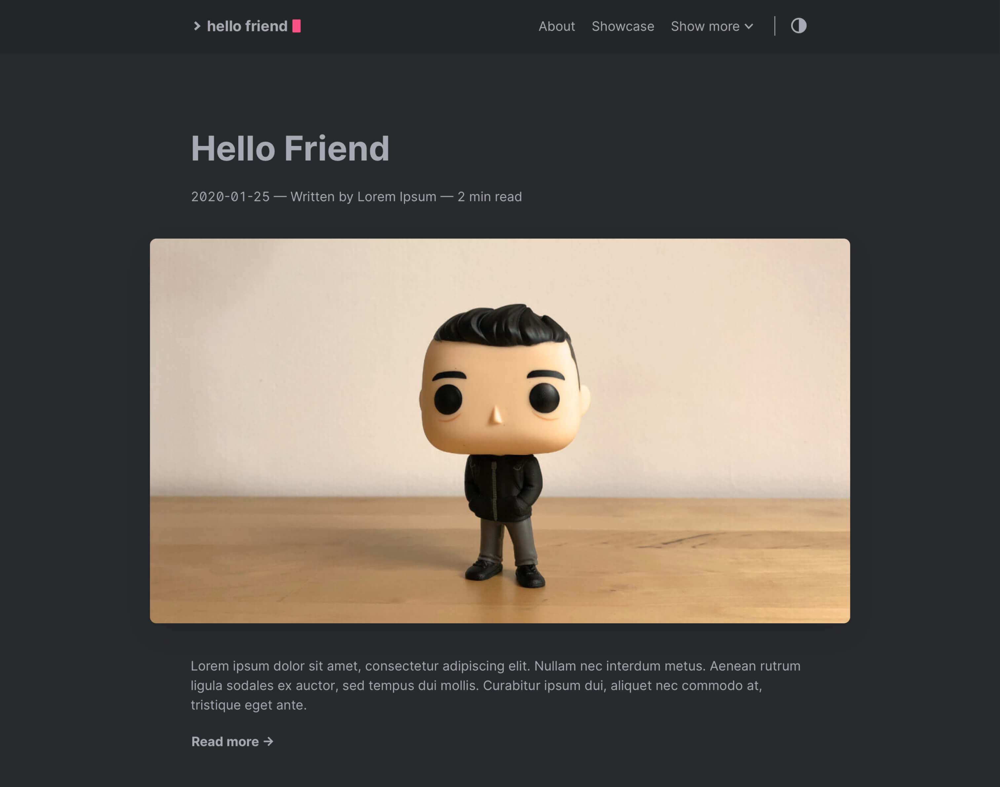
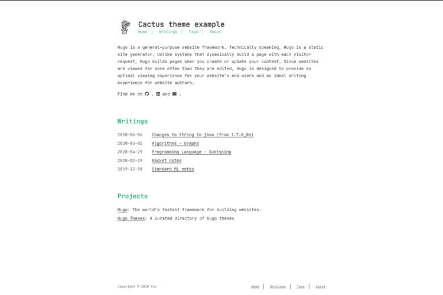
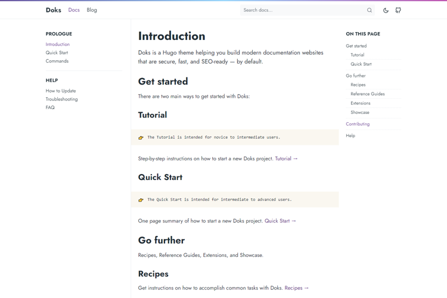
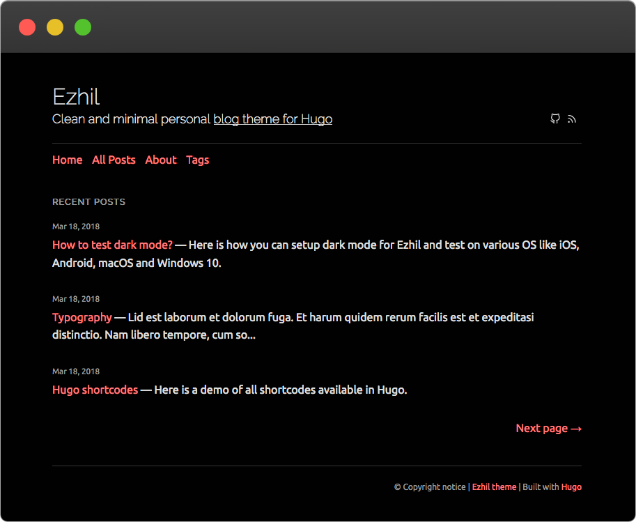
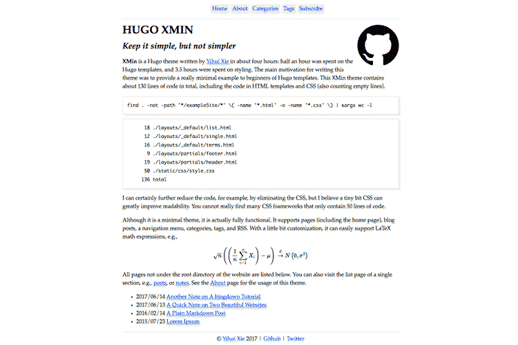

# Thèmes Hugo

## Rocinante

[mavidser/hugo-rocinante](https://github.com/mavidser/hugo-rocinante)

Elegant, lecture agréable, tags, beau sur mobile

Feature unique : type d'article spécial "galerie photo" avec dark mode et layout de deux photos par ligne en fonction du nom de la photo. La bio en haut de l'index (avec les liens sociaux) est aussi répétée en bas des articles.

Pas de cover image, il faut la faire soi-même en mettant une image en haut de son article, et du coup l'image n'est pas cliquable pour rentrer dans l'article. Exception pour les galeries photo qui ont une cover cliquable.

## PaperMod

Features uniques : on précise une cover pour l'open graph mais on peut la cacher de l'article et/ou de la page d'accueil.

## Book

[Introduction](https://themes.gohugo.io//theme/hugo-book/)

EXCELLENT thème pour un wiki/livre minimaliste, mais assez clean pour être étendu.

Features uniques : boutons, colonnes, spoilers, hints, **sections à onglets** (*je pourrais reprendre ça pour fairedesjeux !*)

Et avec tout ça, y a un blog avec taxonomies

## Stack

[Example Site](https://demo.stack.jimmycai.com/)

[CaiJimmy/hugo-theme-stack](https://github.com/CaiJimmy/hugo-theme-stack)

Tellement joli je suis époustouflé. Le graal ?

Exemple d'utilisation concret avec des pages de différentes natures sur le côté (qui donnent trop envie d'explorer btw)

[友人](https://blog.jimmycai.com/links/)

Il a des coms bien plus stylés sur son site que sur le thème public, voir livre d'or, hmm...

## Hello friend

D'une grande élégance et humain, comme l'indique son titre

[Hello Friend](https://hugo-hello-friend.now.sh/)

Mais cover pas cliquable dommage

## Cactus theme

Pour un thème geek, mais mignon et humain, invitant à l'exploration

[Cactus theme example](https://themes.gohugo.io//theme/hugo-theme-cactus/)

## Doks

Documentation moderne, texte grand et espacé

https://jamstackthemes.dev/theme/hugo-doks/

## Ezhil

Thème de blog minimaliste, lisible et doux, invitant à cliquer sur les articles.

https://jamstackthemes.dev/demo/theme/hugo-ezhil/

## XMin

Thème intéressant pour apprendre à faire des thèmes : il ne contient que 130 lignes de code.

https://jamstackthemes.dev/theme/hugo-xmin-theme/

# Thèmes HTML

https://freehtml5.co/

https://html5up.net/

